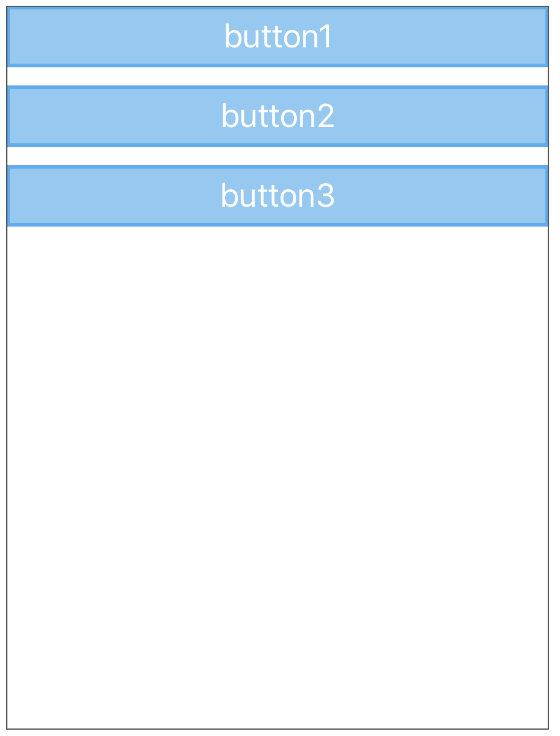
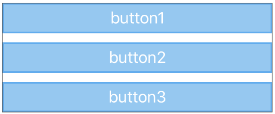
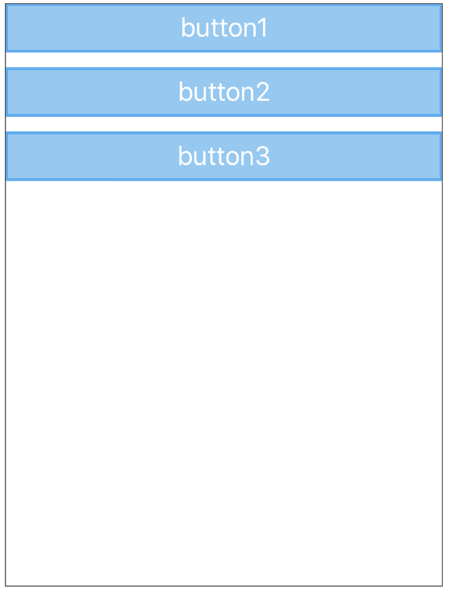
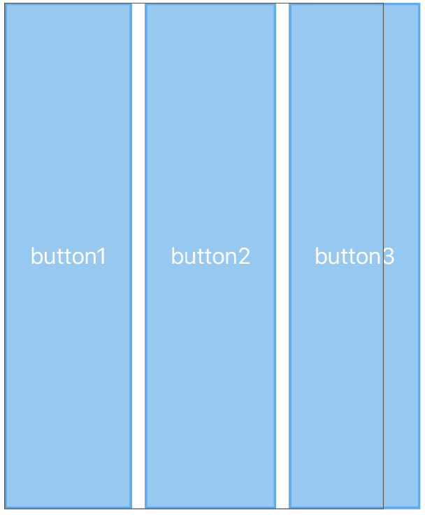
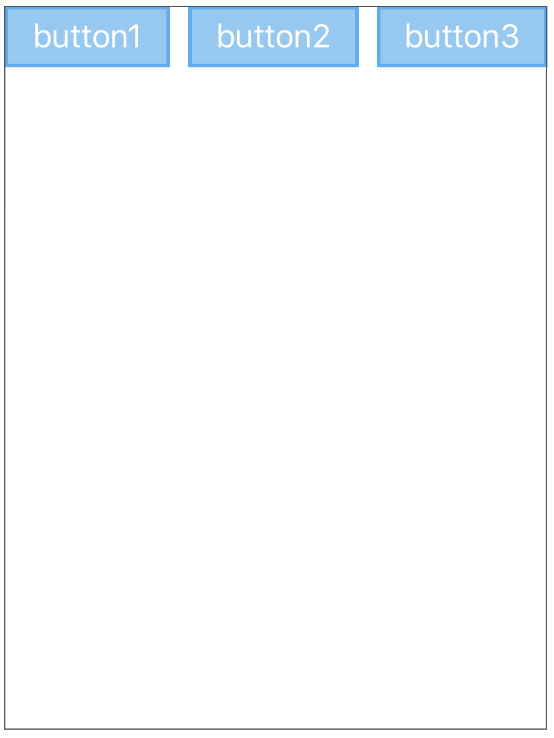
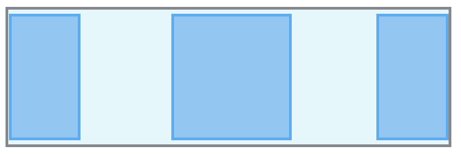
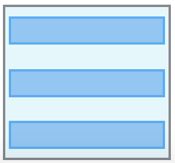
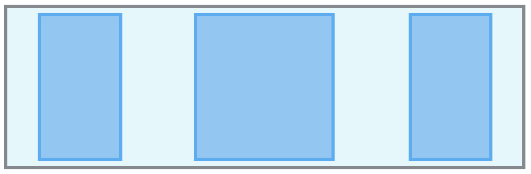

<p align="center">
  <a href="https://github.com/layoutBox/StackViewLayout"></a>
</p>

 
<p align="center">
  <a href=""></a>
  <a href="https://travis-ci.org/layoutBox/StackViewLayout"></a>
  <a href="https://codecov.io/gh/layoutBox/StackViewLayout"></a>
  <a href='https://cocoapods.org/pods/StackViewLayoutView'></a>
  <!--a href="https://github.com/Carthage/Carthage"></a-->
  <a href="https://github.com/layoutBox/StackViewLayout/issues"></a>
</p>
</p>
<p align="center">
  <a href='https://cocoapods.org/pods/StackViewLayout'></a>
  <a href='https://cocoapods.org/pods/StackViewLayout'></a>
  <a href='https://cocoapods.org/pods/StackViewLayout'></a>
</p>

<br>

Extremely Fast StackView without auto layout. Concise syntax, intuitive, readable & chainable. Stacks easily many views horizontally or vertically. Greatly inspired by CSS Flexbox.
  

### Requirements
* iOS 9.0+
* Xcode 8.0+ / Xcode 9.0
* Swift 3.0+ / Swift 4.0

### Content

* [Introduction examples](#intro_usage_example)
* [StackViewLayout principles and philosophy](#introduction)
* [Performance](#performance)
* [Documentation](#documentation)
	* [StackView class](#stackview) 
	* [How to layout StackViews](#stackview_layout)
	* [Managing StackView's items](#managing_items)
	* [StackView properties](#StackView_properties)
	* [Items properties](#items_properties)
		* [Adjusting item's width, height and size](#adjusting_size)
		* [Margins](#margins)

* [API Documentation](#api_documentation)
* [Examples App](#examples_app)
* [FAQ](#faq)
* [Comments, ideas, suggestions, issues, ....](#comments)
* [Installation](#installation)

<br>

:pushpin: StackViewLayout is actively updated. So please come often to see latest changes. You can also **Star** it to be able to retrieve it easily later.

<br>

### StackViewLayout + PinLayout + FlexLayout

<a href="https://github.com/mirego/PinLayout"></a>

Three layout frameworks to rule them all:

* **StackViewLayout**: Stack easily views horizontally or vertically. 
* **[PinLayout](https://github.com/mirego/PinLayout)**: PinLayout is a layout framework greatly inspired by CSS absolute positioning, it is particularly useful for greater fine control and animations, and works perfectly with StactViews. It gives you full control by layouting one view at a time (simple to code and debug).
* **[FlexLayout](https://github.com/layoutBox/FlexLayout)**: FlexLayout is a full-blown flexbox implementation. Use the same engine as ReactNative. 

They all share a similar syntax and method names. Also...

* A view can be layouted using one or many of these frameworks.
* A view layouted using one framework can be embedded inside a view layouted using other frameworks. You choose the best layout framework for your situation. 

<br>
 
<a name="intro_usage_example"></a>
## StackViewLayout Introduction examples 
###### Example 1:


```swift
fileprivate let stackView = StackView()

init() {
   super.init(frame: .zero)
   
   addSubview(stackView)
   ...

   ...
}

override func layoutSubviews() {
    super.layoutSubviews() 

    // 1) Layout the StackView. This example use PinLayout for that purpose, but it could be done 
    //    also by setting the StackView's frame:
    //       stackView.frame = CGRect(x: 0, y: 64, 
    //                                width: frame.width, height: frame.height - 64)
    stackView.pin.all().marginTop(64)
}
``` 

:pushpin: This example is available in the [Examples App](#examples_app). See complete [source code](https://github.com/layoutBox/StackViewLayout/blob/master/Example/StackViewLayoutSample/UI/Examples/Intro/IntroView.swift)

</br>


<a name="introduction"></a>
## StackViewLayout principles and philosophy 

* StackViewLayout layouting is simple, powerful and fast.
* StackViewLayout syntax is concise and chainable.
* StackViewLayout share the same exact API as [FlexLayout](https://github.com/layoutBox/FlexLayout). But its usage is easier in most situations. 
* StackViewLayout is incredibly fast compared to UIStackView. See [Performance](#performance).
* Fine items spacing adjustment using margins. 
* Not too intrusive. StackViewLayout only adds one property to existing iOS classes: `UIView.item`.
* Method's name match [PinLayout](https://github.com/mirego/PinLayout) and [FlexLayout](https://github.com/layoutBox/FlexLayout).
* StackView inherits from UIView, so it supports all visual tweaks, including backgroundColor, layer borders. Which is not the case for UIStackView.
* StackView doesn't have an internal list of items (as [`UIStackView.arrangedSubviews`](https://developer.apple.com/documentation/uikit/uistackview/1616232-arrangedsubviews)), it simply layout all views from its `UIView.subviews` array. 

<br>

<a name="performance"></a>
# StackViewLayout's Performance 
TO BE DOCUMENTED

<br/>
	


# Documentation 

The defining aspect of StackView is the ability to alter its items, width, height to best fill the available space on any display device. A StackView expands its items to fill the available free space or shrinks them to prevent overflow.

The StackViewLayout is constituted of the `StackView` class and its immediate children which are called **items**. 

<a name="axes"></a>
##### Axes 

When working with StackViews you need to think in terms of two axes — the main axis and the cross axis. The main axis is defined by StackView's `direction` property, and the cross axis runs perpendicular to it.

| StackView direction | Axes |
|---------------------|:------------------:|
| **column** |  |
| **row** | |


##### Sections	
In the following sections we will see:

* [StackView class](#stackview) 
* [How to layout StackViews](#stackview_layout)
* [Managing StackView's items](#managing_items)
* [StackView properties](#StackView_properties)
* [Items properties](#items_properties)

TODO: :pushpin: This document is a guide that explains how to use StackViewLayout. You can also checks the [**StackViewLayout API documentation**](https://layoutBox.github.io/StackViewLayout/1.1/Classes/StackViewLayout.html).

<br>

<a name="stackview"></a>
## StackView class 

* StackView class **inherits from UIView**:
	* So, it can be added has a subview and layouted has any other UIView. 
	* It also means it supports all visual tweaks, including backgroundColor, layer borders, rounded corners, .... Which is not the case for an UIStackView.
* StackView **doesn't have an internal list of items** (as [`UIStackView.arrangedSubviews`](https://developer.apple.com/documentation/uikit/uistackview/1616232-arrangedsubviews)), it simply layout all views from its `UIView.subviews` array. 
* StackView layout all visible views (`isHidden = false`) from its `UIView.subviews` array. 


<a name="stackview_layout"></a>
## StackView layout

When you use a StackView, you are responsible for the layout (position and size) of the StackView in its container (superview). Then, the StackView manages the layout and size of its content. Views contained in the StackView are called items.

StackView attempts to fill the space along the main-axis with its items. It sizes each item via its sizeThatFits returned value and if there is a leftover or a lack of space, it uses item's `grow` and `shrink` properties to determine which items to grow or shrink. StackView also takes into account item's margins. See [grow](#grow) and [shrink](#shrink) properties for more details.

###### Usage examples:
```swift
private let stackview = StackView()

init() {
   super.init(frame: .zero)
   
   stackview.define { (stack) in
      stack.addItem(button1)
      stack.addItem(button2)
   }
   addSubView(stackView)
}
  
override func layoutSubviews() {
   super.layoutSubviews() 
   stackView.frame = CGRect(x: 0, y: 0, width: frame.width, height: frame.height)
}
```
<br>

### Layouting StackViews
This section explain how to control the size of a StackView and how it is possible to adjust the StackView's size to match its items.

You must define at least one dimension (width or height) to layout a StackView. 

Two options when layouting StackView:
1. Fixed size
2. StackView adjust its size to match its items 

#### Fixed size
StackView's size can be set to a specific width and height, in this situation the StackView will adjust the size and the position of all its items to fill the available space. You can control how items are layouted using [StackView's properties](#StackView_properties) and [item's properties](#items_properties).

StackView should be layouted either from `UIView.layoutSubviews()` or `UIViewController.viewWillLayoutSubviews()`.

###### Example:
In this example the StackView will be layouted to fill completely its parent. 

Using [PinLayout](https://github.com/mirego/PinLayout):

```swift
init() {
	...   
   stackview.define { (stack) in
      stack.addItem(button1)
      stack.addItem(button2)
      stack.addItem(button3)
   }
   addSubView(stackView)
}
  
override func layoutSubviews() {
   super.layoutSubviews() 
   stackView.pin.all()
}
```

Using `UIView.frame` property:

```swift
override func layoutSubviews() {
   super.layoutSubviews() 
   stackView.frame = CGRect(x: 0, y: 0, width: frame.width, height: frame.height)
}
```

Result:



#### Adjusting size to match its items
StackView can be layouted by specifying only one dimension and letting the StackView compute the other dimension. In this situation StackLayout set its dimension to fit all its items. 

:pushpin: If the StackView adjust its size to match its items, the [`justifyContent`](#justifyContent) property will have no effect.

###### Example:
This example layout a StackView at the top and fill the parent horizontally. The StackView's height will be computed to fit nicely its items. Here is the result:

Using [PinLayout](https://github.com/mirego/PinLayout):

```swift
override func layoutSubviews() {
   super.layoutSubviews() 
   // Use PinLayout sizeToFit(.width) method to adjust the StackView's size.
   stackView.pin.top().left().width(100%).sizeToFit(.width)
}
```

Using `UIView.frame` property:

```swift
override func layoutSubviews() {
   super.layoutSubviews() 
   let adjustedSize = stackView.sizeThatFits(CGSize(width: frame.width, 
                                                    height: .greatestFiniteMagnitude))
   stackView.frame = CGRect(x: 0, y: 0, width: adjustedSize.width, height: adjustedSize.height)
}
```

Result: The StackView height as been adjusted to contain all its items.



<br/>

<a name="layout_method"></a>
### layout() method 
Setting a UIView's frame doesn't layout the view immediately. The layout is postponed. To force the layout of a UIView immediately you must call `UIView.layoutIfNeeded()`.

StackView expose a `layout` method to also force a layout immediately.

* **`layout(mode: SLayoutMode)`**  
The method layout the StackView's items using the current frame's size or by automatically adjusting the width or the height to match its items.

	**mode:**
	* **.fitContainer**: This is the default mode when no parameter is specified. Items are layouted **inside** the StackView (width and height).
	* **.adjustHeight**: In this mode, items are layouted **using only the StackView's width**. The container's height will be adjusted to fit its items.
	* **.adjustWidth**: In this mode, items are layouted **using only the StackView's height**. The StackView width will be adjusted to fit its items.

TODO: Does this method is really required?

<br/>

<a name="managing_items"></a>
## 2. Managing StackView's items 

### Adding items to a StackView 
- Applies to: `StackView`
- Returns: StackItem interface of the newly added item.

StackView layout all visible views (`isHidden = false`) in the `UIView.subviews` array. 

Here is the list methods to add or insert items to a StackView.

:pushpin: Since StackView layout all views in the `UIView.subviews` array, it is also possible to add or insert views using:

* `addSubview(_ view: UIView)`
* `insertSubview(_ view: UIView, at index: Int)`
* `insertSubview(_ view: UIView, aboveSubview: UIView)`
* `insertSubview(_ view: UIView, belowSubview: UIView)`

**Methods:**

* **`addItem(_: UIView) -> StackItem`**  
This method adds an item (UIView) to a StackView. The item is added as the last item. Internally this method adds the UIView as a subview. Note that you can also use .
* **`insertItem(_ view: UIView, at index: Int) -> StackItem`**  
This method adds an item (UIView) at the specified index. Note that you can also use `insertSubview(_ view: UIView, at index: Int)`.
* **`insertItem(_ view: UIView, before refItem: UIView) -> StackItem?`**  
This method adds an item (UIView) before the specified reference item. Note that you can also use `insertSubview(_ view: UIView, aboveSubview: UIView)`.
* **`insertItem(_ view: UIView, after refItem: UIView) -> StackItem?`**  
This method adds an item (UIView) after the specified reference item. Note that you can also use `insertSubview(_ view: UIView, belowSubview: UIView)`.

###### Usage examples:
```swift
  stackview.addItem(imageView)
  stackview.addItem(titleLabel, after: imageView)
```
<br>

### Removing items 
- Applies to: `StackView`

:pushpin: StackView layout all views in the `UIView.subviews` array. So it is also possible to remove items views using `removeFromSuperview()`.

**Method:**

* **`removeItem(_ view: UIView)`**  
Removes the specified item from the StackView. Note that you can also use `removeFromSuperview()`.

###### Usage example:
```swift
  stackview.removeItem(descriptionLabel)
```

### define()
- Applies to: `StackView`

**Method:**

* **`define(_ closure: (_ stackView: StackView) -> Void)`**  
This method is used to structure your code so that it matches the view structure. The method has a closure parameter with a single parameter called `stackView`. This parameter is in fact the StackView instance. 

###### Usage examples:
```swift
  stackview.define { (stack) in
      stack.addItem(imageView)
      stack.addItem(nameLabel)
      stack.addItem(descriptionLabel)
  }
```

The same results can also be obtained without using the `define()` method.

```swift
   stackview.addItem(imageView)
   stackview.addItem(nameLabel)
   stackview.addItem(descriptionLabel)
```

**Advantages of using `define()`**:

* The source code structure matches the views structure, making it easier to understand and modify.
* Changing an item order, it's just moving up/down its line/block that defines it.
* Moving an item from one StackView to another is just moving line/block that defines it.

<br>
 
<a name="StackView_properties"></a>
## 3. StackView properties  
This section describes StackView properties that affect how items are layouted.

<a name="direction"></a>
### direction 
- Applies to: `StackView`
- Values: `column` / `row`
- Default value: `column`
- Method: **`direction(_: SDirection)`**  

The `direction` property establishes the [main-axis](#axes), thus defining the direction items are placed in the StackView. 

| Value | Result | Description |
|---------------------|:------------------:|---------|
| **column** (default) 	| | Top to bottom |
| **row** | | Same as text direction |


###### Usage examples:
```swift
  stackView.direction(.column)  // Not required, default value. 
  stackView.direction(.row)
```

###### Example 1:
This example show a StackView of size 300x400 containing three buttons with a margin of 10 pixels between them. 

```swift
   stackView.define { (stack) in
      stack.addItem(button1)
      stack.addItem(button2).marginTop(10)
      stack.addItem(button3).marginTop(10)
    }
    
   override func layoutSubviews() {
      super.layoutSubviews() 
      stackView.width(300).height(400)
   }
``` 



Buttons are stretched horizontally because StackView's default [`alignItems`](#alignItems) property is `.stretch`. Also, we don't need to set the [`direction`](#direction) since the default value is `.column`.


###### Example 2:
Using the same setup as the Example 1, but using the `.row` direction.

```swift
    stackview.direction(.row).define { (stack) in
       stack.addItem(button1)
       stack.addItem(button2).marginTop(10)
       stack.addItem(button3).marginTop(10)
    }
``` 



Not really the expected result, right?! Two issues:

1. Buttons are too tall: By default StackView `alignItems` property is set to `.stretch`, which cause items to stretch in the cross axis direction. To fix that we need to change that to `.start`. See [`alignItems`](#alignItems) for more details.  
2. Buttons overflow the StackView: The reason for this is that the size of the three buttons + margins are wider than the specified StackView's width (300 pixels). To contain buttons inside the StackView, we can increase the StackView's width OR we must allow at least one item to shrink if there is not enough space. By default item don't shrink. To enable this we must set the item's `shrink` property. We want that all buttons shrink equitably, so we set each button the same `shrink` property. See [`shrink`](#shrink) for more details.  

```swift
   stackView.direction(.row).alignItems(.start).define { (stack) in
      stack.addItem(button1).shrink(1)
      stack.addItem(button2).marginLeft(10).shrink(1)
      stack.addItem(button3).marginLeft(10).shrink(1)
   }
``` 



Much better! 

<br/>

<a name="justifyContent"></a>
### justifyContent 
- Applies to: `StackView`
- Values: `start` / `end` / `center` / `spaceBetween` / `spaceAround` / `spaceEvenly`
- Default value: `start`
- Method: **`justifyContent(_: JustifyContent)`** 

The `justifyContent` property defines the alignment along the main-axis. It helps distribute extra free space leftover when either all items have reached their maximum size. For example, for a column StackView, `justifyContent` controls how items align vertically. 

This property is similar to `UIStackView.distribution` (UIStackViewDistribution)


|                     	| direction(.column) | direction(.row) | |
|---------------------	|:------------------:|:---------------:|:--|
| **start** (default) 	| | | Items are packed at the beginning of the main-axis. |
| **end**	| | | Items are packed at the end of the main-axis. |
| **center** 	| | | items are centered along the main-axis. |
| **spaceBetween** 	| |  | Items are evenly distributed in the main-axis; first item is at the beginning, last item at the end. |
| **spaceAround** 	|  |  | Items are evenly distributed in the main-axis with equal space around them. Items have a half-size space on either end. |
| **spaceEvenly** 	|  |  | Items are evenly distributed in the main-axis with equal space around them. |

###### Usage examples:
```swift
  stackView.justifyContent(.start)  // default value. 
  stackView.justifyContent(.center)
```


TODO: Add an example!!!

<br/>

<a name="alignItems"></a>
### alignItems 
- Applies to: `StackView`
- Values: `stretch` / `start` / `end` / `center`
- Default value: `stretch `
- Method: **`alignItems(_: AlignItems)`**  

The `alignItems` property defines how items are laid out along the cross axis. Similar to `justifyContent` but for the cross-axis (perpendicular to the main-axis). For example, for a column StackView, `alignItems` controls how they align horizontally. 

This property is similar to `UIStackView.alignment` (UIStackViewAlignment)

|                     	| direction(.column) | direction(.row) |
|---------------------	|:------------------:|:---------------:|
| **stretch** (default) 	| | |
| **start**	| | |
| **end**	| | |
| **center** 	| | |


TODO: Add an example!!!

<br/>

<a name="items_properties"></a>
## 4. Item properties 
This section describes all StackView's item properties.

### alignSelf
- Values: `auto` / `stretch` / `start` / `end` / `center`
- Default value: `auto`
- method: **`alignSelf(_: AlignSelf)`**

The `alignSelf` property controls how an item aligns in the cross direction, overriding the `alignItems` of the StackView. For example, for a column StackView, `alignSelf` will control how the item will align horizontally. 

The `auto` value means use the stack view `alignItems` property. See `alignItems` for documentation of the other values.

TODO: Add an example!!!

<br/>


<a name="grow"></a>
### grow 
- Default value: 0
- method: **`grow(_: CGFloat)`** 

The `grow` property defines the ability for an item to grow if necessary. It accepts a unitless value that serves as a proportion. It dictates what amount of the available space inside the StackView the item should take up.

A `grow` value of 0 (default value) keeps the view's size in the main-axis direction. If you want the view to use the available space set a `grow` value > 0.

For example, if all items have `grow` set to 1, every child will grow to an equal size inside the container. If you were to give one of the children a value of 2, that child would take up twice as much space as the others.

TODO: Add an example!!!

<br>

<a name="shrink"></a>
### shrink 
- Default value: 0
- Method: **`shrink(_: CGFloat)`** 

The `shrink` defines how much the item will shrink relative to the rest of items in the StackView **when there isn't enough space on the main-axis**.
  
A shrink value of 0 keeps the view's size in the main-axis direction. Note that this may cause the view to overflow its flex container.
  
Shrink is about proportions. If an item has a shrink of 3, and the rest have a shrink of 1, the item will shrink 3x as fast as the rest.

TODO: Add an example!!!

<br>

<a name="adjusting_size"></a> 
### Adjusting item's width, height and size 

StackView's items size can be set manually using the following methods.

**Methods:**

* **`width(_ width: CGFloat?)`**  
The value specifies the view's width in pixels. The value must be non-negative. Call `width(nil)` to reset the property.
* **`width(_ percent: SPercent)`**  
The value specifies the view's width in percentage of its container width. The value must be non-negative. Call `width(nil)` to reset the property.
* **`height(_ height: CGFloat?)`**  
The value specifies the view's height in pixels. The value must be non-negative. Call `height(nil)` to reset the property.
* **`height(_ percent: SPercent)`**  
The value specifies the view's height in percentage of its container height. The value must be non-negative. Call `height(nil)` to reset the property.
* **`size(_ size: CGSize?)`**  
The value specifies view's width and the height in pixels. Values must be non-negative. Call `size(nil)` to reset the property.
* **`size(_ sideLength: CGFloat?)`**  
The value specifies the width and the height in pixels, creating a square view. Values must be non-negative. Call `size(nil)` to reset the property.


###### Usage examples:
```swift
  view.item.width(100)	
  view.item.width(50%)	
  view.item.height(200)
	
  view.item.size(250)
```

TODO: Add an example!!!

<br>

<a name="minmax_width_height_size"></a>
### minWidth, maxWidth, minHeight, maxHeight 

StackView's items min/max width and min/max height can be specified.

Using minWidth, minHeight, maxWidth, and maxHeight gives you increased control over the final size of items. By mixing these properties with `grow`, `shrink`, and `alignItems(.stretch)`, you are able to have items with dynamic size within a range which you control.

An example of when Max properties can be useful is if you are using `alignItems(.stretch)` but you know that your item won’t look good after it increases past a certain point. In this case, your item will stretch to the size of its parent or until it is as big as specified in the Max property.

Same goes for the Min properties when using `shrink`. For example, you may want an item to shrink, but if you specify a minimum width, the item won't be shrink past the specified value.

Another case where Min and Max dimension constraints are useful is when using `aspectRatio`.

**Methods:**

* **`minWidth(_ width: CGFloat?)`**  
The value specifies the view's minimum width in pixels. The value must be non-negative. Call `minWidth(nil)` to reset the property.
* **`minWidth(_ percent: SPercent)`**  
The value specifies the view's minimum width of the view in percentage of its container width. The value must be non-negative. Call `minWidth(nil)` to reset the property..
* **`maxWidth(_ width: CGFloat?)`**  
The value specifies the view's maximum width in pixels. The value must be non-negative. Call `maxWidth(nil)` to reset the property.
* **`maxWidth(_ percent: SPercent)`**  
The value specifies the view's maximum width of the view in percentage of its container width. The value must be non-negative. Call `maxWidth(nil)` to reset the property.
* **`minHeight(_ height: CGFloat?)`**  
The value specifies the view's minimum height in pixels. The value must be non-negative. Call `minHeight(nil)` to reset the property.
* **`minHeight(_ percent: SPercent)`**  
The value specifies the view's minimum height of the view in percentage of its container height. The value must be non-negative. Call `minHeight(nil)` to reset the property.
* **`maxHeight(_ height: CGFloat?)`**  
The value specifies the view's maximum height in pixels. The value must be non-negative. Call `maxHeight(nil)` to reset the property.
* **`maxHeight(_ percent: SPercent)`**  
The value specifies the view's maximum height of the view in percentage of its container height. The value must be non-negative. Call `maxHeight(nil)` to reset the property.
   
###### Usage examples:
```swift
  view.item.maxWidth(200)
  view.item.maxWidth(50%)
  view.item.width(of: view1).maxWidth(250)
	
  view.item.maxHeight(100)
  view.item.height(of: view1).maxHeight(30%)
```

TODO: Add an example!!!

<br>

<a name="margins"></a>
### Margins 

By applying Margin to an item you specify the offset a certain edge of the item should have from it’s closest sibling or parent (StackView).

**Methods:**

* **`marginTop(_ value: CGFloat)`, `marginTop(_ percent: FPercent)`**  
Specify the offset the top edge of the item should have from it’s closest sibling (item) or parent (StackView).
* **`marginLeft(_ value: CGFloat)`, `marginLeft(_ percent: FPercent)`**  
Specify the offset the left edge of the item should have from it’s closest sibling (item) or parent (StackView).
* **`marginBottom(_ value: CGFloat)`, `marginBottom(_ percent: FPercent)`**  
Specify the offset the bottom edge of the item should have from it’s closest sibling (item) or parent (StackView)
* **`marginRight(_ value: CGFloat)`, `marginRight(_ percent: FPercent)`**  
Specify the offset the right edge of the item should have from it’s closest sibling (item) or parent (StackView).
* **`marginStart(_ value: CGFloat)`, `marginStart(_ percent: FPercent)`**  
Set the start margin. In LTR direction, start margin specify the **left** margin. In RTL direction, start margin specify the **right** margin.
* **`marginEnd(_ value: CGFloat)`, `marginEnd(_ percent: FPercent)`**  
Set the end margin. In LTR direction, end margin specify the **right** margin. In RTL direction, end margin specify the **left** margin.
* **`marginHorizontal(_ value: CGFloat)`, `marginHorizontal(_ percent: FPercent)`**  
Set the left, right, start and end margins to the specified value.
* **`marginVertical(_ value: CGFloat)`, `marginVertical(_ percent: FPercent)`**  
Set the top and bottom margins to the specified value.
* **`margin(_ insets: UIEdgeInsets)`**
Set all margins using an UIEdgeInsets. This method is particularly useful to set all margins using iOS 11 `UIView.safeAreaInsets`.
* **`margin(_ insets: NSDirectionalEdgeInsets)`**
Set all margins using an NSDirectionalEdgeInsets. This method is useful to set all margins using iOS 11 `UIView. directionalLayoutMargins` when layouting a view supporting RTL/LTR languages.
* **`margin(_ value: CGFloat) `**  
Set all margins to the specified value.
* **`margin(_ vertical: CGFloat, _ horizontal: CGFloat)`**
* **`margin(_ top: CGFloat, _ horizontal: CGFloat, _ bottom: CGFloat)`**
* **`margin(_ top: CGFloat, _ left: CGFloat, _ bottom: CGFloat, _ right: CGFloat)`**

###### Usage examples:
```swift
  view.item.margin(20)
  view.item.marginTop(20%).marginLeft(20%)
  view.item.marginHorizontal(20)
  view.item.margin(safeAreaInsets)
  view.item.margin(10, 12, 0, 12)
  
  // Margin is defined inline
  stackview.addItem(separatorView).margin(20)
```

<br>

<a name="aspect_ratio"></a>
### aspectRatio() 

NOT IMPLEMENTED YET. COMING SOON.

<br/>


### Nesting StackViews

TODO:
If you run into situations where multiple elements need to be arranged along multiple axes, UIStackViews can be nested inside each other. Below is the layout from the example project. Each property UILabel and UISegmentedControl are contained in a UIStackView. All of the UIStackViews are then contained in a parent UIStackView denoted on the left.

<br/>

### StackViewLayout default properties

This table resume **StackView's default properties**:

| Property     | StackView default value |
|--------------|--------------------------|
| **`direction`** | .column |
| **`justifyContent`** | .start |
| **`alignItems`** | .stretch |

This table resume **Items default properties**:

| Property     | Items default value |
|--------------|--------------------------|
| **`alignSelf`** | .auto |
| **`grow`** | 0 |
| **`shrink`** | 0 |

<br>


## 8. Differences with FlexLayout/FlexBox

* Top and bottom margins using percentages  
	* StackViewLayout resolve percentages in marginTop and marginBottom against the **height of the container**.
	* FlexLayout/flexbox resolve percentages in marginTop and marginBottom against the **width of the container**.

<br>

<a name="api_documentation"></a>
## StackViewLayout API Documentation 
The [**complete StackViewLayout API is available here**](https://layoutBox.github.io/StackViewLayout/1.1/Classes/StackViewLayout.html). 

<br>

<a name="examples_app"></a>
## Example App 

NOT IMPLEMENTED YET. COMING SOON.

<br>


<a name="faq"></a>
## FAQ 

COMING SOON.

<br/>

<a name="comments"></a>
## Contributing, comments, ideas, suggestions, issues, .... 
For any **comments**, **ideas**, **suggestions**, simply open an [issue](https://github.com/layoutBox/StackViewLayout/issues). 

For **issues**, please have a look at [Yoga's issues](https://github.com/facebook/yoga/issues). Your issue may have been already reported. If not, it may be a StackViewLayout issue. In this case open an issue and we'll let you know if the issue is related to Yoga's implementation. 

If you find StackViewLayout interesting, thanks to **Star** it. You'll be able to retrieve it easily later.

If you'd like to contribute, you're welcome!

<br>


<a name="installation"></a>
## Installation 

### CocoaPods

To integrate StackLayoutView into your Xcode project using CocoaPods, specify it in your `Podfile`:

```ruby
    pod 'StackLayoutView'
```

Then, run `pod install`.

### Carthage
NOT IMPLEMENTED YET. COMING SOON.

### Swift Package Manager
NOT IMPLEMENTED YET. COMING SOON.

<br>

## Changelog
StackViewLayout recent history is available in the are documented in the [CHANGELOG](CHANGELOG.md).

<br>

## License
BSD 3-Clause License 
